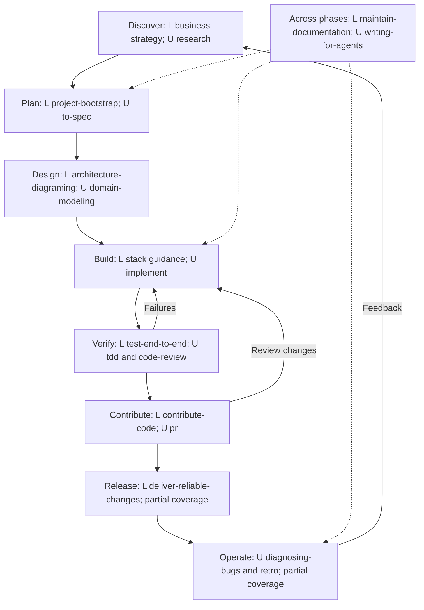

# Agent Plugins

Reusable bundles of skills for application development, business strategy and visual communication. Our concise Markdown skills describe preferred outcomes and conventions; selected upstream skills provide specialist techniques. The agent chooses implementation details from the request, existing code and accepted decisions.

Packages use [Agent Plugins 1.0.0](https://agent-plugins.org/specification): `plugin.json` and `skills/<name>/SKILL.md`. These are guidance bundles, with no generated application or required project template. Tickets, trackers and elaborate planning workflows are optional.

[Usage guide and example prompts](documentation/usage.md) · [Workflow selection](plugins/development-workflow/WORKFLOW.md) · [Upstream catalogue](documentation/upstream-sources.md)

## What the pieces do

| Piece | Role | Example |
| --- | --- | --- |
| Plugin | Bundles skills related to an activity | `web-frontend` |
| Local skill | Defines our preferred approach | Reuse shadcn components and existing design tokens |
| Upstream skill | Supplies implementation or workflow expertise | Vercel React practices, Matt Pocock's TDD |
| Project `AGENTS.md` | Records the application's commands, conventions and accepted decisions | Keep documentation synchronized with code |
| MCP server | Optionally gives the agent live tools | Browse a shadcn registry or interact with a browser |

Installing a plugin makes skills available; it does not require running every skill. No MCP servers or hooks are configured in the current bundles.

## Bundles

| Plugin | Guidance | Upstream expertise included when built |
| --- | --- | --- |
| `development-workflow` | Project structure, documentation, E2E, delivery, Git contribution flow | Matt Pocock engineering/productivity skills, Playwright, GitHub Actions hardening, Trail of Bits testing/review |
| `python-backend` | Python, uv, FastAPI/Uvicorn, SQLAlchemy/Alembic, PostgreSQL, optional FastMCP | Trail of Bits modern-python; Anthropic MCP builder |
| `web-frontend` | Next.js, shadcn, consistent UI/UX, accessibility and performance | Official shadcn; Vercel React practices and composition |
| `ai-development` | Framework choice, Gemini LLM/audio experiments, evaluation and tool boundaries | Official Google ADK and LangChain/LangGraph skills |
| `business-strategy` | Existing strategy and opportunity-analysis skills | Original resources preserved |
| `visual-communication` | Existing architecture-diagram and presentation skills | Original resources preserved |

For a full-stack application, use workflow + backend + frontend; add AI when needed. Load task-relevant skills rather than every skill at once. The new local skills are concise principles: the agent chooses implementation details from the product, existing code and accepted decisions. Upstream guidance contributes expertise without expanding the requested scope or overriding those decisions. Use compatible installed UI/UX skills locally.

Local development skills include decision rules, examples and proportionate completion criteria: a real persisted journey, resource ownership, deliberate migrations, consistent rendered UI and explicit AI evaluation boundaries. These guide the agent toward observable outcomes while leaving implementation choices open. See [skill evaluation evidence and limits](documentation/skill-evaluation.md).

## SDLC coverage

This is a capability map, not a mandatory sequence. Enter at the phase relevant to the request, iterate when evidence changes the plan, and select only useful skills. **L** means local principles; **U** means bundled upstream expertise. The diagram shows representative skills; the table maps the complete current inventory.



| Phase or activity | Local skills | Upstream skills | Contribution and limits |
| --- | --- | --- | --- |
| Discovery and requirements | `business-strategy`; legacy `business-opportunity-analysis` only as fallback | `research`, `grill-me`, `grilling`, `grill-with-docs`, `to-questionnaire`, `prototype` | Test the problem and assumptions, clarify scope, explore uncertainty. Interviews/prototypes are optional; market analysis is not evidence of user adoption. |
| Planning and project setup | `project-bootstrap` | `to-spec`, `wayfinder`, optional `to-tickets` | Choose a useful slice and proportionate plan. Conversation/Markdown scope is sufficient; tickets and tracker setup are optional. |
| Architecture, domain and UX design | `architecture-diagraming`, `build-consistent-frontend`, `build-python-backend`, `build-evaluated-ai` | `domain-modeling`, `codebase-design`, `improve-codebase-architecture`, `adk-architecture`, `vercel-composition-patterns` | Choose boundaries, data/ownership rules and reusable interactions. Framework-specific skills apply only to the chosen stack. |
| Implementation | `build-python-backend`, `build-consistent-frontend`, `build-evaluated-ai` | `implement`, `implement-spec`, `modern-python`, `mcp-builder`, `shadcn`, `vercel-react-best-practices`, `vercel-composition-patterns`, `adk-agent-builder`, `langchain-fundamentals`, `langchain-dependencies`, `langgraph-fundamentals`, `langgraph-persistence` | Apply stack expertise to the agreed feature. Orchestration is explicitly chosen; MCP/AI frameworks are used only when needed. |
| Testing and review | `test-end-to-end`, `deliver-reliable-changes`, `build-evaluated-ai` | `tdd`, `playwright-cli`, `property-based-testing`, `code-review`, `differential-review` | Establish behavior, persistence, authorization and appropriate model quality. Security-focused diff review is not a complete threat model or security audit. |
| Git contribution and PR | `contribute-code`, `deliver-reliable-changes` | `pr` | Isolate feature work, commit coherently, publish/update the correct PR and explain impact with evidence. Review does not automatically authorize merge/deployment. |
| Release and deployment | `deliver-reliable-changes` | `github-actions-hardening`; `wizard` for requested human setup | **Partial:** CI security, configuration and migration/recovery principles. No dedicated release, environment-promotion or deployment verification skill. |
| Operations and maintenance | `deliver-reliable-changes`, `maintain-documentation` | `diagnosing-bugs`, `retro`; `triage` when explicitly using tracked issues/PRs | **Partial:** diagnosis, basic health/logging, runbooks and learning. No dedicated production SLO, incident, backup/restore or capacity workflow. |
| Knowledge and communication across phases | `maintain-documentation`, `presentation-building`, `architecture-diagraming` | `writing-for-agents`, `handoff`, `teach`, `wait-what` | Keep authoritative knowledge current, explain decisions and preserve context. Presentation/teaching activities remain task-specific. |
| Skill selection and optional setup | Local workflow guidance | `ask-matt`, `setup-matt-pocock-skills`, `wizard` | Route to relevant activities; configure tools only when requested. Packaging does not execute setup. |

The same skill can support several phases; repeated entries do not represent duplicate installations. Upstream names above use actual skill metadata, which can differ from source directory names. MCPs provide optional execution tools, not another SDLC phase; see [optional tools](#optional-tools).

### Gaps worth addressing next

These are suggested capabilities, **not additional installed skills**. Extend an existing guide where a few rules suffice; create a focused skill only for a distinct recurring workflow.

| Priority | Gap | Useful scope for future guidance |
| --- | --- | --- |
| First | Release and recovery | Target-aware deployment, staging/production configuration, compatible migrations, post-deploy smoke checks, rollback/roll-forward and release evidence |
| First | Operating the application | Useful logs/metrics/traces, user-facing health/SLOs when warranted, incident diagnosis, recovery, backup/restore verification and capacity/cost signals |
| Next | Security and privacy design | Assets/trust boundaries, abuse cases, data minimization/retention, secrets and dependency risk; connect design risks to implementation checks |
| As needed | Performance and resilience verification | Representative load, concurrency, latency/error budgets, query behavior and bounded failure/retry behavior beyond frontend optimization |
| As needed | Product feedback and experiments | Instrument intended outcomes, evaluate adoption/usability and feed evidence into roadmap decisions rather than treating feature delivery as success |

Potential upstream additions to review separately: Trail of Bits [supply-chain-risk-auditor](https://github.com/trailofbits/skills/blob/main/plugins/supply-chain-risk-auditor/skills/supply-chain-risk-auditor/SKILL.md) for dependency risk, and GitHub's [phoenix-tracing](https://github.com/github/awesome-copilot/blob/main/skills/phoenix-tracing/SKILL.md) for Phoenix-specific AI observability. Neither fills generic release/operations coverage. Check their fit, resources, license and immutable pins before packaging; they are not in the current lockfile.

## Invocation and workflow selection

Our `project-bootstrap` starts only on an explicit request. The seven other local development skills are agent-invoked when relevant and can also be invoked manually. `contribute-code` applies by default to feature development and Git/PR work: use a feature worktree, Conventional Commits, optional issue references and concise PR descriptions. Automatic selection helps perform the requested work without expanding its scope.

Matt's released engineering and productivity skills join `development-workflow`, including `implement`, `implement-spec`, their testing/review dependencies, and setup. Preserve his user/agent distinction: user-invoked orchestration is a deliberate choice; agent-invoked guidance is task-matched. See the concise [workflow map](plugins/development-workflow/WORKFLOW.md) for available activities, documentation paths and setup boundaries. No workflow is mandatory for every change. Implementation and review work directly from your request or a Markdown spec/plan; tickets and trackers are optional, including for `implement-spec`.

Local skills use standard name/description frontmatter and Markdown instructions, with no Codex-specific metadata. User/agent invocation intent is expressed in the descriptions and workflow guidance; actual selection depends on the client. Upstream resources retain their supplied metadata, but our guidance does not depend on it. Packaging verifies metadata, not runtime discovery in every client.

## Quick start

From the repository root, with Python and Git available, build the full-stack bundles with their upstream skills:

```bash
python -m venv .venv
source .venv/bin/activate
python -m pip install -r requirements-validation.txt
python scripts/build_plugins.py --destination ./built-plugins
```

This produces `built-plugins/development-workflow`, `built-plugins/python-backend` and `built-plugins/web-frontend`. Install those individual directories through your client's supported plugin route, then open the application repository in that client. Packaging is separate from client installation; no universal client install command is supplied here. The activation command above is for a POSIX shell.

For example, once those plugins are available:

> Use project-bootstrap to start a small Next.js/shadcn and FastAPI/PostgreSQL application for saving named searches. Apply the installed workflow, backend and frontend guidance. Build one useful vertical slice, keep documentation current, and test saving and reopening a search. Use this conversation as the scope; no tickets or tracker.

For an existing application:

> Add deletion of a user's saved searches. Preserve the existing architecture and UI conventions. Verify ownership enforcement and the browser journey, update affected documentation, and report the checks you ran.

See the [usage guide](documentation/usage.md) for AI bundles, planning, debugging, review and optional tools.

## Source checkout versus built plugins

| Form | Contents | Use |
| --- | --- | --- |
| `plugins/<name>` | Local skills and plugin guidance | Install when only our principles are needed |
| `built-plugins/<name>` | Local guidance plus actual pinned upstream skills and resources | Install when upstream expertise is also wanted |

The helper clones the sources listed in [upstream.lock.json](upstream.lock.json), checks directory hashes, copies complete resources and preserves licenses. Existing destinations are never overwritten; choose a new destination for another build. It does not install application dependencies, create projects or configure clients. Upstream updates require changing the reviewed pins and rebuilding.

## Optional tools

MCPs are optional: shadcn for component/registry work, Playwright for browser exploration, and a project's FastMCP server when application tools are needed. Configure them for the actual application and client. No servers or hooks are enabled automatically. Hooks are client-specific extensions; add one only for a concrete recurring need. Skills alone are valid plugins.

## Compatibility and maintenance

The original skills moved from `skills/` into their activity bundles without changing their content. Existing skills-only users can still run `./scripts/sync-skills.sh sync` (`status` and `remove` are also supported). This links local skills only; it does not acquire upstream content or configure MCPs.

```bash
python scripts/validate_plugins.py
python -m unittest discover -s tests -v
```

Keep new guidance concise and project-independent. Local material is MIT; acquired upstream skills retain their own terms. Private installed skills are never redistributed. Native client discovery depends on the client; package validation is not an application test.

| Repository path | Purpose |
| --- | --- |
| `plugins/` | Plugin manifests, local skills and supporting resources |
| `documentation/` | Usage guide and upstream catalogue |
| `upstream.lock.json` | Reviewed upstream acquisition pins |
| `scripts/` | Build, validation and skills-only compatibility helpers |
| `schemas/`, `tests/` | Package schemas and helper regression checks |
| `AGENTS.md` | Instructions for maintaining this repository |
