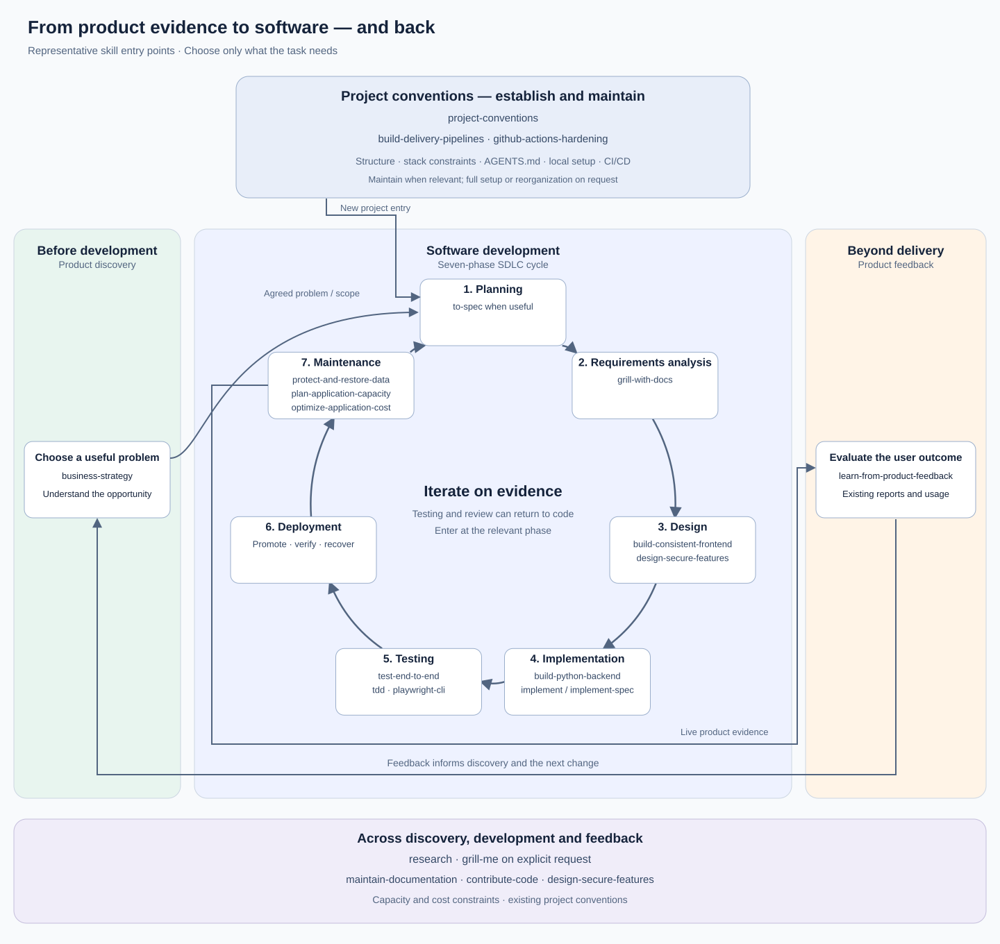

# Agent Plugins

Reusable bundles of skills for application development, business strategy and visual communication. Our concise Markdown skills describe preferred outcomes and conventions; selected upstream skills provide specialist techniques. The agent chooses implementation details from the request, existing code and accepted decisions.

Packages use [Agent Plugins 1.0.0](https://agent-plugins.org/specification): `plugin.json` and `skills/<name>/SKILL.md`. These are guidance bundles, with no generated application or required project template. Tickets, trackers and elaborate planning workflows are optional.

[Usage guide and example prompts](documentation/usage.md) · [Workflow selection](plugins/development-workflow/WORKFLOW.md) · [Upstream catalogue](documentation/upstream-sources.md)

## What the pieces do

| Piece | Role | Example |
| --- | --- | --- |
| Plugin | Bundles skills related to an activity | `web-frontend` |
| Local skill | Defines our preferred approach | Reuse shadcn components and existing design tokens |
| Upstream skill | Supplies implementation or workflow expertise | Vercel React practices, Matt Pocock's TDD |
| Project `AGENTS.md` | Records the application's commands, conventions and accepted decisions | Keep documentation synchronized with code |
| MCP server | Optionally gives the agent live tools | Browse a shadcn registry or interact with a browser |

Installing a plugin makes skills available; it does not require running every skill. No MCP servers or hooks are configured in the current bundles.

## Bundles

| Plugin | Guidance | Upstream expertise included when built |
| --- | --- | --- |
| `development-workflow` | Project structure, documentation, E2E, Git contributions, CI/CD and security/privacy | Matt Pocock engineering/productivity skills, Playwright, GitHub Actions hardening, Trail of Bits testing/review and dependency risk |
| `python-backend` | Python, uv, FastAPI/Uvicorn, SQLAlchemy/Alembic, PostgreSQL, optional FastMCP | Trail of Bits modern-python; Anthropic MCP builder |
| `web-frontend` | Next.js, shadcn, consistent UI/UX, accessibility and performance | Official shadcn; Vercel React practices and composition |
| `ai-development` | Framework choice, Gemini LLM/audio experiments, evaluation and tool boundaries | Official Google ADK and LangChain/LangGraph skills |
| `business-strategy` | Strategy, opportunity analysis and product feedback | Original resources preserved; vendor-specific analytics are references |
| `application-operations` | Backup/restore and DR, capacity/concurrency and cost | Microsoft AKS cost optimization, only for AKS |
| `visual-communication` | Existing architecture-diagram and presentation skills | Original resources preserved |

For a full-stack application, use workflow + backend + frontend; add AI when needed. Load task-relevant skills rather than every skill at once. The new local skills are concise principles: the agent chooses implementation details from the product, existing code and accepted decisions. Upstream guidance contributes expertise without expanding the requested scope or overriding those decisions. Use compatible installed UI/UX skills locally.

Local development skills include decision rules, examples and proportionate completion criteria: a real persisted journey, resource ownership, deliberate migrations, consistent rendered UI and explicit AI evaluation boundaries. These guide the agent toward observable outcomes while leaving implementation choices open. See [skill evaluation evidence and limits](documentation/skill-evaluation.md).

## SDLC coverage

The lifecycle below uses the [common seven-phase breakdown](https://www.ibm.com/think/topics/sdlc): **planning, requirements analysis, design, implementation, testing, deployment and maintenance**. Phase names and grouping vary between models; this separates planning from requirements analysis. Product discovery establishes what is worth building; feedback evaluates the live product and informs the next cycle. Both also happen during development. The diagram separates their scope rather than imposing handoff gates or a waterfall process.



Links are in the table so they remain usable in GitHub and clients that render diagrams as images. The names in the diagram are representative entry points, not a checklist. Supporting helpers, Git contributions, documentation and security are not invented SDLC phases.

| Scope / phase | Relevant local guidance | Directly relevant bundled upstream expertise |
| --- | --- | --- |
| Outside the cycle: project foundations | [project-conventions](plugins/development-workflow/skills/project-conventions/SKILL.md); [build-delivery-pipelines](plugins/development-workflow/skills/build-delivery-pipelines/SKILL.md) | [github-actions-hardening](https://github.com/github/awesome-copilot/tree/143a3d976b3c1603cc8932984d5e1f28501cb5fc/skills/github-actions-hardening) for the delivery capability |
| Before: product discovery | [business-strategy](plugins/business-strategy/skills/business-strategy/SKILL.md) | Research and clarification are available across the lifecycle, below |
| 1. Planning | Agree scope, constraints and the next useful increment | [to-spec](https://github.com/mattpocock/skills/tree/4588b32ecab9ecc9fc8cc6b6c5e7d675b6004b0d/skills/engineering/to-spec) when a separate spec is useful |
| 2. Requirements analysis | Clarify requirements and observable acceptance criteria | [grill-with-docs](https://github.com/mattpocock/skills/tree/4588b32ecab9ecc9fc8cc6b6c5e7d675b6004b0d/skills/engineering/grill-with-docs) for requested requirements clarification |
| 3. Design | [build-python-backend](plugins/python-backend/skills/build-python-backend/SKILL.md); [build-consistent-frontend](plugins/web-frontend/skills/build-consistent-frontend/SKILL.md); [design-secure-features](plugins/development-workflow/skills/design-secure-features/SKILL.md) | [domain-modeling](https://github.com/mattpocock/skills/tree/4588b32ecab9ecc9fc8cc6b6c5e7d675b6004b0d/skills/engineering/domain-modeling); [vercel-composition-patterns](https://github.com/vercel-labs/agent-skills/tree/063bee94c3f4df8453406c830b0a7df0f2860278/skills/composition-patterns) for React architecture |
| 4. Implementation | [build-python-backend](plugins/python-backend/skills/build-python-backend/SKILL.md); [build-consistent-frontend](plugins/web-frontend/skills/build-consistent-frontend/SKILL.md); [build-evaluated-ai](plugins/ai-development/skills/build-evaluated-ai/SKILL.md) when AI is needed | [implement](https://github.com/mattpocock/skills/tree/4588b32ecab9ecc9fc8cc6b6c5e7d675b6004b0d/skills/engineering/implement) / [implement-spec](https://github.com/mattpocock/skills/tree/4588b32ecab9ecc9fc8cc6b6c5e7d675b6004b0d/skills/engineering/implement-spec) when explicitly choosing those workflows; [modern-python](https://github.com/trailofbits/skills/tree/82fe8226252622fa807643bdca1710901198553a/plugins/modern-python/skills/modern-python); [shadcn](https://github.com/shadcn-ui/ui/tree/6b600cf1ff42f8a746747ea587e52af3ee224643/skills/shadcn) |
| 5. Testing | [test-end-to-end](plugins/development-workflow/skills/test-end-to-end/SKILL.md); [deliver-reliable-changes](plugins/development-workflow/skills/deliver-reliable-changes/SKILL.md) | [tdd](https://github.com/mattpocock/skills/tree/4588b32ecab9ecc9fc8cc6b6c5e7d675b6004b0d/skills/engineering/tdd); [playwright-cli](https://github.com/microsoft/playwright-cli/tree/b85c7a736bb473bf55b584e54a09ffa698d6d871/skills/playwright-cli) for browser journeys |
| 6. Deployment | [build-delivery-pipelines](plugins/development-workflow/skills/build-delivery-pipelines/SKILL.md) — promotion, verification, rollback / roll-forward | [github-actions-hardening](https://github.com/github/awesome-copilot/tree/143a3d976b3c1603cc8932984d5e1f28501cb5fc/skills/github-actions-hardening) supports the maintained delivery capability |
| 7. Maintenance | [protect-and-restore-data](plugins/application-operations/skills/protect-and-restore-data/SKILL.md); [plan-application-capacity](plugins/application-operations/skills/plan-application-capacity/SKILL.md); [optimize-application-cost](plugins/application-operations/skills/optimize-application-cost/SKILL.md) | [diagnosing-bugs](https://github.com/mattpocock/skills/tree/4588b32ecab9ecc9fc8cc6b6c5e7d675b6004b0d/skills/engineering/diagnosing-bugs) for diagnosis; [aks-cost-optimization](https://github.com/Azure/AKS-Skills/tree/20bf35201a79b324d2ca3e00e5c82020ff362024/skills/aks-cost-optimization) **only for AKS** |
| Beyond delivery: product feedback | [learn-from-product-feedback](plugins/business-strategy/skills/learn-from-product-feedback/SKILL.md) | No analytics vendor required; optional Amplitude reference in the skill |

Project foundations sit outside the repeating cycle: establish structure, stack constraints, instructions, local setup and delivery capabilities for a new project, then maintain the affected parts as it evolves. The entry arrow into Planning is not a required setup gate for every change. CI/CD is a maintained capability used during implementation, testing and deployment.

**Across discovery, development and feedback:** [research](https://github.com/mattpocock/skills/tree/4588b32ecab9ecc9fc8cc6b6c5e7d675b6004b0d/skills/engineering/research) and [grill-me](https://github.com/mattpocock/skills/tree/4588b32ecab9ecc9fc8cc6b6c5e7d675b6004b0d/skills/productivity/grill-me) can support any relevant phase. `grill-me` still starts only on an explicit request; placing it here does not authorize automatic interrogation. [maintain-documentation](plugins/development-workflow/skills/maintain-documentation/SKILL.md) keeps project knowledge aligned; [contribute-code](plugins/development-workflow/skills/contribute-code/SKILL.md) supplies the default worktree/commit/PR flow; [design-secure-features](plugins/development-workflow/skills/design-secure-features/SKILL.md) revisits data and authority risks. Security review and dependency auditing use relevant Trail of Bits expertise rather than masquerading as full security/privacy coverage. Capacity, cost and recovery constraints inform design as well as maintenance. CI/CD supports implementation and testing as well as deployment.

The mapping deliberately omits general helpers and stack tools whose relevance depends on the specific task. See the [upstream catalogue](documentation/upstream-sources.md) and [workflow selection](plugins/development-workflow/WORKFLOW.md) for the wider inventory. Tickets remain optional.

### Product feedback in practice

Ask whether users achieved the outcome, rather than whether the feature shipped. Start with available support reports, observations and usage; organize evidence by problem and affected users, then decide what to investigate or change. For a saved-search application, successful saves and later reopening are more useful signals than page views. Combine those signals with reports of confusing names or poor discoverability. A small user base may justify a few focused conversations rather than an analytics platform or an A/B test.

The output is a short evidence note: question, sources/time window, findings and limits, next action and how to assess it. Feed accepted work into requirements/planning and revisit the outcome afterward. No mandatory tracker, survey program, telemetry installation or external communication. See [feedback example](documentation/usage.md#product-feedback).

### Operations instructions still to integrate

Backup/restore, disaster recovery, capacity and cost are covered by focused principles, with platform-specific references and an AKS-only upstream skill. Detailed **observability, monitoring, incident response, SLIs/SLOs, load testing and failure testing** remain pending the user's operating instructions. Existing diagnostic and focused performance checks do not establish those workflows. Architectural guidance already addresses concurrency, dependency budgets and latency; it does not impose a load/chaos test regimen in advance.

## Invocation and workflow selection

Our `project-conventions` begins full project setup or reorganization only on an explicit request; agents apply it to focused upkeep when the requested change affects project conventions. Other local development and operations guidance is task-matched and can also be invoked manually. `contribute-code` applies by default to feature development and Git/PR work: use a feature worktree, Conventional Commits, optional issue references and concise PR descriptions. Automatic selection helps perform the requested work without expanding its scope.

Matt's released engineering and productivity skills join `development-workflow`, including `implement`, `implement-spec`, their testing/review dependencies, and setup. Preserve his user/agent distinction: user-invoked orchestration is a deliberate choice; agent-invoked guidance is task-matched. See the concise [workflow map](plugins/development-workflow/WORKFLOW.md) for available activities, documentation paths and setup boundaries. No workflow is mandatory for every change. Implementation and review work directly from your request or a Markdown spec/plan; tickets and trackers are optional, including for `implement-spec`.

Local skills use standard name/description frontmatter and Markdown instructions, with no Codex-specific metadata. User/agent invocation intent is expressed in the descriptions and workflow guidance; actual selection depends on the client. Upstream resources retain their supplied metadata, but our guidance does not depend on it. Packaging verifies metadata, not runtime discovery in every client.

## Quick start

From the repository root, with Python and Git available, build the full-stack bundles with their upstream skills:

```bash
python -m venv .venv
source .venv/bin/activate
python -m pip install -r requirements-validation.txt
python scripts/build_plugins.py --destination ./built-plugins
```

This produces `built-plugins/development-workflow`, `built-plugins/python-backend` and `built-plugins/web-frontend`. Install those individual directories through your client's supported plugin route, then open the application repository in that client. Packaging is separate from client installation; no universal client install command is supplied here. The activation command above is for a POSIX shell.

For example, once those plugins are available:

> Use project-conventions to start a small Next.js/shadcn and FastAPI/PostgreSQL application for saving named searches. Apply the installed workflow, backend and frontend guidance. Build one useful vertical slice, keep documentation current, and test saving and reopening a search. Use this conversation as the scope; no tickets or tracker.

For an existing application:

> Add deletion of a user's saved searches. Preserve the existing architecture and UI conventions. Verify ownership enforcement and the browser journey, update affected documentation, and report the checks you ran.

See the [usage guide](documentation/usage.md) for AI bundles, planning, debugging, review and optional tools.

## Source checkout versus built plugins

| Form | Contents | Use |
| --- | --- | --- |
| `plugins/<name>` | Local skills and plugin guidance | Install when only our principles are needed |
| `built-plugins/<name>` | Local guidance plus actual pinned upstream skills and resources | Install when upstream expertise is also wanted |

The helper clones the sources listed in [upstream.lock.json](upstream.lock.json), checks directory hashes, copies complete resources and preserves licenses. Existing destinations are never overwritten; choose a new destination for another build. It does not install application dependencies, create projects or configure clients. Upstream updates require changing the reviewed pins and rebuilding.

## Optional tools

MCPs are optional: shadcn for component/registry work, Playwright for browser exploration, and a project's FastMCP server when application tools are needed. Configure them for the actual application and client. No servers or hooks are enabled automatically. Hooks are client-specific extensions; add one only for a concrete recurring need. Skills alone are valid plugins.

## Migrating from the previous skills layout

The original four skills retain their names, content and resources. Their locations changed:

| Previous directory | New directory |
| --- | --- |
| `skills/business-strategy/` | [plugins/business-strategy/skills/business-strategy/](plugins/business-strategy/skills/business-strategy/) |
| `skills/business-opportunity-analysis/` | [plugins/business-strategy/skills/business-opportunity-analysis/](plugins/business-strategy/skills/business-opportunity-analysis/) |
| `skills/architecture-diagraming/` | [plugins/visual-communication/skills/architecture-diagraming/](plugins/visual-communication/skills/architecture-diagraming/) |
| `skills/presentation-building/` | [plugins/visual-communication/skills/presentation-building/](plugins/visual-communication/skills/presentation-building/) |

After updating your checkout to the plugin version, choose the route matching your installation:

- **Linked with our helper:** run `./scripts/sync-skills.sh status`, then `./scripts/sync-skills.sh sync`. This repairs links to the old `skills/` paths in `~/.agents/skills` from this same checkout, including broken links. It preserves unrelated files/links and adds the available local skills. To select one skill, use `./scripts/sync-skills.sh sync business-strategy`. Keep the checkout in place; this route links local skills only.
- **Copied or linked manually:** update the source paths above and replace the complete skill directory, including resources. Preserve your custom edits and check for duplicate installations. The helper does not update copied directories or links from another checkout.
- **Moving to plugins:** install the relevant individual plugin directories through your client's supported route. Use the [build instructions](#quick-start) for bundles containing upstream skills. Retire duplicate old installations after verifying the new ones; packaging alone does not install plugins or configure MCPs.

If you tried an earlier version of this PR, `project-bootstrap` and its interim name `maintain-project-foundations` are now `project-conventions`. Update saved prompt references and replace the old installed entry; a legacy helper link to that renamed skill needs manual cleanup after checking its target. No application repository migration or new tracker is required.

## Maintenance

```bash
python scripts/validate_plugins.py
python -m unittest discover -s tests -v
```

Keep new guidance concise and project-independent. Local material is MIT; acquired upstream skills retain their own terms. Private installed skills are never redistributed. Native client discovery depends on the client; package validation is not an application test.

| Repository path | Purpose |
| --- | --- |
| `plugins/` | Plugin manifests, local skills and supporting resources |
| `documentation/` | Usage guide and upstream catalogue |
| `upstream.lock.json` | Reviewed upstream acquisition pins |
| `scripts/` | Build, validation and skills-only compatibility helpers |
| `schemas/`, `tests/` | Package schemas and helper regression checks |
| `AGENTS.md` | Instructions for maintaining this repository |
