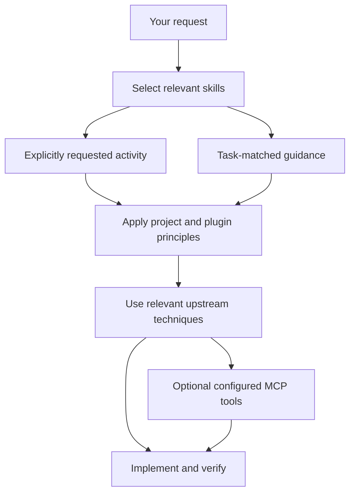

# Using the plugins

Choose the bundles for your activity, install them in your agent client, and work in the application repository. Local skills steer the approach; upstream skills contribute techniques. Existing project instructions and accepted decisions remain authoritative.

Use the [SDLC map](../README.md#sdlc-coverage) to locate relevant local/upstream skills and distinguish current coverage from suggested additions. The phases describe capabilities, not required ceremonies.

## Choose bundles

| Work | Bundles |
| --- | --- |
| Full-stack application | `development-workflow`, `python-backend`, `web-frontend` |
| Python API or application MCP | `development-workflow`, `python-backend` |
| Frontend work | `development-workflow`, `web-frontend` |
| LLM, agents or transcription | Add `ai-development` to the application's relevant bundles |
| Business analysis | `business-strategy` |
| Architecture diagrams or presentations | `visual-communication` |

You do not need to load all installed skills into every task. Reuse compatible UI/UX skills already installed in the client; private skills remain local.

## Build and install

The [README quick start](../README.md#quick-start) builds the three full-stack bundles. Explicit `--plugin` arguments replace that default selection, so include every bundle you want. For full-stack development with AI:

```bash
python scripts/build_plugins.py \
  --plugin development-workflow \
  --plugin python-backend \
  --plugin web-frontend \
  --plugin ai-development \
  --destination ./built-plugins-with-ai
```

For just the strategy and visual bundles:

```bash
python scripts/build_plugins.py \
  --plugin business-strategy \
  --plugin visual-communication \
  --destination ./built-communication-plugins
```

These two bundles already contain their original resources; they acquire no additional upstream skills. For local guidance only, install directly from `plugins/<name>` instead of building.

Install each chosen plugin directory through the client's documented plugin route. Keep the whole directory, including `WORKFLOW.md`, skill references and notices. Do not copy only a `SKILL.md` and lose its supporting material. Confirm the client exposes the intended skills before relying on them; the builder does not register plugins or configure MCPs.

The builder needs Git, the Python packages in `requirements-validation.txt`, and source access when a pinned commit is not cached. It packages skill resources without executing their scripts. A build destination must not already exist. Updating the repository alone does not update an installed bundle: rebuild into a new destination and replace the installation using the client's supported route.

The legacy `./scripts/sync-skills.sh sync` route links local skills only. It does not install complete plugins or fetch upstream content; preserve the linked repository and its supporting files. Use `status` to inspect links and `remove` to remove links managed by the helper.

## What triggers a skill?



**User-invoked** skills begin distinct activities on an explicit request. Examples include a full setup/reorganization with `maintain-project-foundations`, `grill-me`, `to-spec`, `implement`, `implement-spec` and `retro`. A plain-language request can express that intent; exact command syntax and discovery depend on the client.

**Agent-invoked** skills support work already requested. Examples include our backend/frontend/AI guidance, documentation, E2E, delivery and `contribute-code` skills, plus upstream debugging, TDD and review guidance. These can also be requested manually.

Local skills rely on standard name/description metadata and Markdown guidance, not client-specific configuration files. The explicit-request boundary is an instruction to the agent, not a universal runtime enforcement mechanism. Upstream resources retain supplied client metadata; using our local guidance does not require it. Ask for a skill by name if automatic selection misses it.

## Example requests

The following prompts assume the named skills are installed. Use the client's supported invocation syntax if it requires one.

### Start a project

> Use maintain-project-foundations to organize a small appointment application with Next.js/shadcn and FastAPI/PostgreSQL. Start with creating and viewing an appointment. Apply the backend and frontend guidance, keep code under applications/ and knowledge under documentation/, and add concise AGENTS.md instructions. Build and test the first useful slice before adding more architecture.

Expected approach: select the relevant skills, choose a proportionate structure, implement a useful flow and record actual decisions. No template generator or mandatory planning ceremony is involved.

### Implement from this conversation, without tickets

> Use implement-spec for the scope we agreed here: users can save named search filters, reopen them and delete their own saved searches. Prevent access to another user's searches. Use this conversation as the spec; do not create tickets or configure a tracker. Verify API authorization and the browser journey, including persistence after reload, and update affected documentation.

The [workflow guide](../plugins/development-workflow/WORKFLOW.md#project-fit) explicitly overrides upstream ticket prerequisites. Tickets, labels, issue IDs and tracker setup are optional. Parallel execution also depends on client subagent/worktree support; use a simpler supported approach when unavailable.

### Make a small change

> Fix the mobile layout of the saved-search list. Reuse existing shadcn components and tokens. Check loading, empty and error states, keyboard access and the affected browser journey. Keep the change focused and update documentation only where behavior changed.

Routine work can go directly to implementation. No interview, spec or orchestration workflow is required for every change.

### Develop a feature and open its PR

> Add saved-search deletion in the target application repository. Use contribute-code to create a feature worktree from the project's intended base and keep all code, tests and documentation for this objective there. Use Conventional Commits, run the relevant checks, push the branch and open a concise PR in that repository. No tracker is used. Explain the problem, resulting behavior, impact and actual verification; include a Mermaid diagram only if it clarifies the change.

The skill is agent-invoked for this activity even when not named. It inspects the repository/remotes/base, reuses an existing worktree/PR for follow-up work, and prefers Git/`gh` CLI with GitHub MCP fallback. If an existing issue association is unclear, it may ask once; no issue means no issue scope or tracker setup. Repository component-scope conventions remain authoritative. Publishing a PR does not merge or deploy it.

### Write a plan before implementation

> Use to-spec to turn our agreed requirements into a concise Markdown plan under the project's documentation convention. Include acceptance criteria, important risks and open questions. This turn is plan-only: do not implement, create tickets or publish anything externally.

### Debug and review

> Use diagnosing-bugs to investigate why saved searches disappear after a new session. Reproduce the failure and trace it through the UI, API and PostgreSQL before changing code. Add a regression check, then use code-review against the agreed behavior. Report what was actually verified.

### Add an AI feature

> Add uploaded-audio transcription for Portuguese recordings. Apply build-evaluated-ai and the relevant backend guidance. Start with a direct Gemini SDK call unless orchestration is useful. Verify current model support, quotas and pricing; use fixtures in routine CI and a separate live evaluation with representative audio. Do not assume all requests are free.

Use ADK or LangChain/LangGraph expertise for the framework actually chosen. Installing the AI bundle does not require using both frameworks.

### Strategy and visual communication

> Use business-strategy to evaluate this product idea, separating evidence from assumptions and recording consequential decisions.

> Use architecture-diagraming to explain the application's current frontend, API, database and external integrations. Base the diagram on the implementation and mark planned components clearly.

## Optional MCPs and hooks

| Capability | Skill guidance | Optional live tools |
| --- | --- | --- |
| Components and registries | Official shadcn skill, local frontend conventions | shadcn MCP |
| Browser exploration and testing | Playwright CLI skill, local E2E guidance | Playwright MCP |
| Application tools for agents | Backend guidance, MCP builder | The application's FastMCP server |

Skills explain techniques; MCP servers expose tools. The Playwright CLI skill does not install Playwright MCP. Browser testing can use the application's normal Playwright test setup without an MCP server.

No MCPs or hooks are configured in the current bundles. Configure a server in the chosen client only when needed, against the actual application, with appropriate access. See the [upstream catalogue](upstream-sources.md#additional-references) for official setup references. Hooks are client-specific and should address a concrete recurring need.

## Project knowledge and verification

For new applications, the local skills prefer `applications/` for code, migrations, tests, application configuration and scoped instructions, with provider-required CI entrypoints in their required locations. They prefer `documentation/` for product, architecture/data contracts, decisions, plans, UX, operations and verification knowledge. Create useful documents as needed; preserve existing conventions deliberately.

Keep the application's root `AGENTS.md` short: purpose, stack, commands and shared conventions, including a requirement to synchronize affected documentation with implementation and decisions. Put local exceptions beside the code.

The repository's validation checks package structure, metadata and packaging behavior. They do not prove your application's quality. Ask the agent to report the application checks it actually ran, important user journeys exercised, mocked boundaries and remaining gaps. Installation makes guidance available; it does not automatically enforce application standards.

The local skills provide concrete decision rules and completion criteria, not a requirement to run every check on every change. Select evidence for the affected risk: a visual fix needs rendered inspection; an ownership change needs direct cross-user access tests; a model feature needs separate application and live-quality evidence. [Skill evaluation](skill-evaluation.md) records how the guidance was exercised and what those checks cannot establish.

## Delivery and recovery

> Review our API's Dockerfile and GitHub Actions. Apply build-delivery-pipelines: readable workflow/job/step names, one immutable artifact promoted through environments, post-deploy checks, and a usable rollback or roll-forward route compatible with migrations. Explain what you verified and what still needs an environment rehearsal.

Install `application-operations` when recovery, sizing or cost is part of the project. To acquire its AKS specialist with the existing helper:

```bash
python scripts/build_plugins.py --plugin application-operations --destination ./built-operations
```

This outputs `built-operations/application-operations`. Install that directory through the client's supported route. Local principles apply to the actual hosting platform; the upstream AKS skill is only relevant on Azure AKS. No MCP server is automatically configured.

> Review backup and recovery for this PostgreSQL application on EKS with RDS. Use protect-and-restore-data. Identify RPO/RTO assumptions, database and object-store coverage, isolated restore verification, application cutover and the documentation that changes with migrations. Consult current AWS/PostgreSQL documentation; don't deploy infrastructure from this review alone.

> Estimate capacity and monthly EUR cost for this application in its actual European region. Use plan-application-capacity and optimize-application-cost. Include peak demand, database connections across replicas, autoscaling constraints and backup/egress/AI costs. Distinguish measured usage and billed cost from assumptions and projected savings.

## Product feedback

> Use learn-from-product-feedback on these anonymized support notes and usage export. Are users able to save and later reuse a search? Identify evidence and uncertainty, the smallest useful next change and how we'd assess it. No analytics setup, user outreach or tickets.

The feedback skill is in `business-strategy`. Use existing evidence first. A request to analyze feedback does not authorize sending surveys or enabling tracking.

## Security and performance by design

> Add private saved-search sharing. Apply design-secure-features and the backend/frontend guidance. Identify authority boundaries, data exposure/retention and abuse cases; enforce them in code and focused checks. Consider concurrency and latency on the critical path. Use relevant installed security-review skills without claiming a complete audit.

Detailed observability/incident/SLO and load/failure-testing workflows will be integrated after the user's operating instructions are supplied. The current skills leave those decisions open.

## Maintaining project foundations

> Add a background worker to this existing application. Use maintain-project-foundations for the affected startup/configuration and scoped instructions; update the worker's checks and delivery commands using the specialist guidance. Preserve the existing layout and stack. No repository-wide reorganization or new planning ceremony.

For users of the old `skills/` layout, see the [README migration note](../README.md#migrating-from-the-previous-skills-layout).
