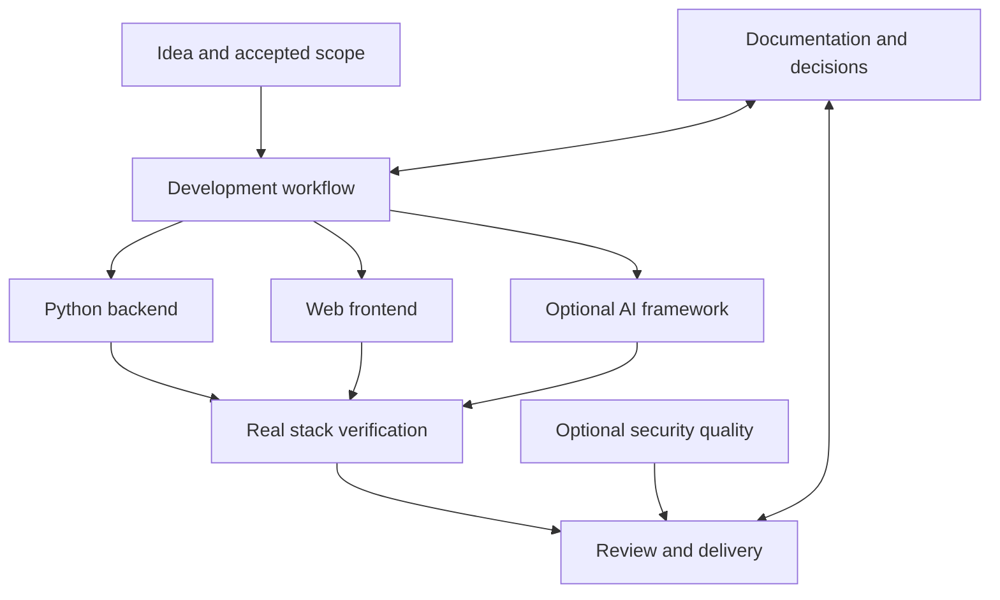
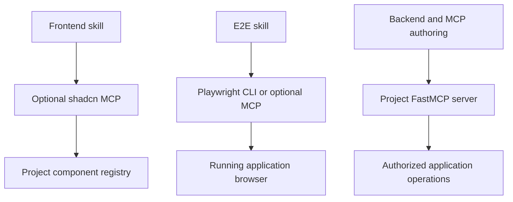

# Plugin and workflow map

Local policy skills decide project conventions. Acquired specialist skills contribute implementation techniques. MCPs and executable tools expose live capabilities only when a project explicitly configures them.

| Plugin | Local opinion / acquired skills | Workflow contribution |
| --- | --- | --- |
| development-workflow | Bootstrap, scoped AGENTS, docs sync, E2E and reliable delivery; Microsoft playwright-cli, GitHub Actions hardening, Superpowers systematic-debugging + verification-before-completion | Plan → implement → diagnose → prove → deliver |
| python-backend | FastAPI/Uvicorn, uv, SQLAlchemy/Alembic/Postgres; Trail of Bits modern-python | API, persistence, migrations and Python tooling |
| web-frontend | Next.js/TypeScript/shadcn, existing design tokens; Vercel React practices, composition patterns; official shadcn skill | Consistent UI, composition, accessibility and performance |
| ai-development | Local evaluated AI contract | Gemini test preference, deterministic CI, safety/auth/cost boundaries |
| ai-adk | Official ADK builder + architecture | Optional ADK implementation; use with ai-development |
| ai-langchain | Official LangChain fundamentals/dependencies, LangGraph fundamentals/persistence | Optional LangChain/LangGraph implementation; use with ai-development |
| security-quality | Sentry code-review; Trail of Bits property-based-testing + differential-review | Targeted review and domain invariants when risk warrants |
| mcp-development | Anthropic mcp-builder | Optional MCP authoring under the local Python/FastMCP contract |
| business-strategy | Existing strategy/opportunity skills | Problem, positioning, business case and assumptions |
| visual-communication | Existing diagram/presentation skills | Architecture communication and decision narratives |

## Tool boundary

The full-stack default builds 3 plugins and 8 upstream skills. AI framework, security, strategy and visual communication are opt-in. Installation is separate from executing runtime tools. Browser exploration is not an E2E success claim: delivery requires the actual browser → Next.js → FastAPI → migrated PostgreSQL journey, asserted persistent state and authorization, plus documented evidence. Documentation changes travel with implementation and decisions.

## Context discipline

Use task-matched skills, not every skill at once. Preserve local application architecture and accepted design decisions. Upstream defaults do not introduce a second AI framework, an unrequested approval workflow, or a different frontend stack. Record repeated corrections as a scoped rule or mechanical check. A successful scaffold is not a working application, and a successful test command is evidence only for the journeys it actually exercises.
