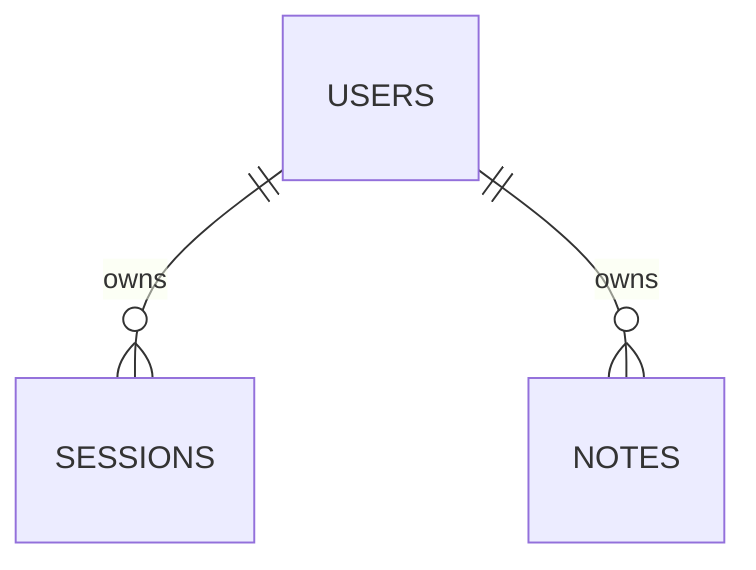

# Data model

users: UUID primary key, unique normalized email, Argon2 password hash. sessions: SHA-256 hash of random session token, owner FK/index, UTC expiry. notes: UUID primary key, owner FK/index, title <=120 characters, UTC creation time. Session cookies contain only the opaque random token; hashes are stored in the DB. Cascade deletes cover account-owned data. No private note content in logs.

Alembic 0001 creates the reviewed schema. Downgrade destroys all demo data; test on an isolated database only. Future live migrations require an expand/contract and recovery decision.
