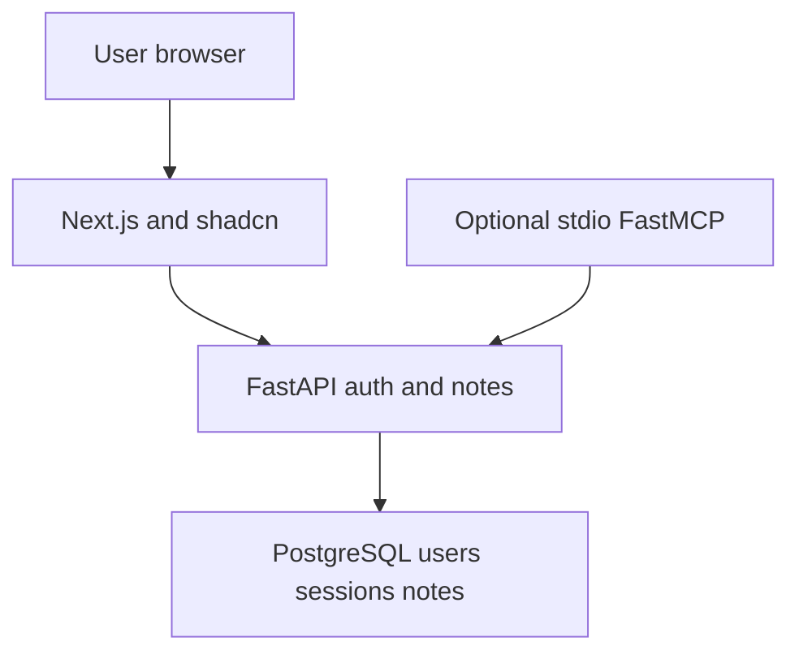

# Architecture

A modular FastAPI service owns auth, notes and PostgreSQL. Next.js proxies same-origin /api requests to it. SQLAlchemy sessions are request-scoped; reviewed Alembic migrations own DDL. No runtime create_all. Backend ownership predicates enforce isolation, independent of UI or model.

C4 context: user accesses a private notebook; optional MCP exposes authenticated read-only notes. Containers: Next.js, API, PostgreSQL. Components: HTTP auth/note adapters, session and ownership policy, ORM persistence; optional AI output validator and MCP adapter. One backend deployment by default.
